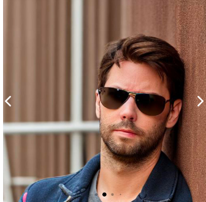
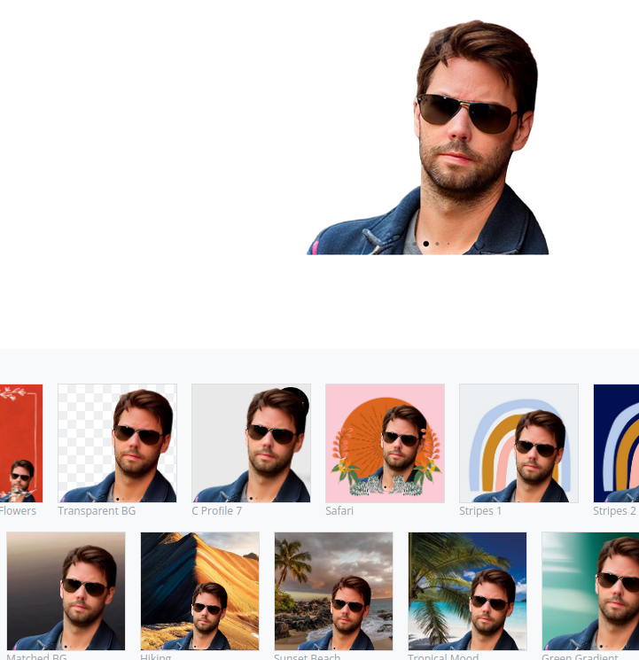

# Remove Background

Here are the state of the art model fo background removal

## Apps

- **remove.bg** : [remove.bg](images/https://remove.bg)
    
    

- **Designify**: Another interesting App is Designify
  

- **Unscreen**: [https://www.unscreen.com/](https://www.unscreen.com/)
  

## References

- [DeepLabV3+](https://github.com/nikhilroxtomar/Remove-Photo-Background-using-TensorFlow)

- [Tiramisu](https://towardsdatascience.com/background-removal-with-deep-learning-c4f2104b3157) Model trained on some classes of COCO dataset

- [LiveCodeStream](https://livecodestream.dev/post/remove-the-background-from-images-using-ai-and-python/)
