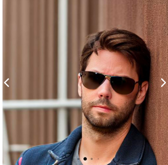
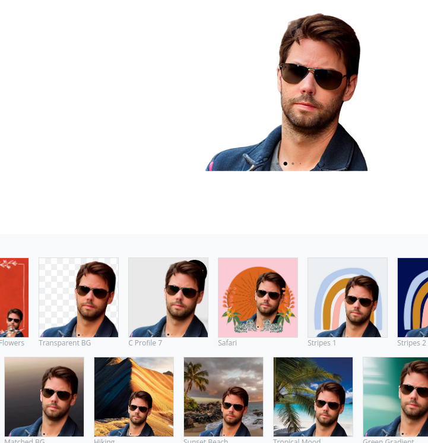

# Remove Background

Here are the state of the art model fo background removal

## References

- [remove.bg](https://remove.bg)
- DeepLabV3+ https://github.com/nikhilroxtomar/Remove-Photo-Background-using-TensorFlow

- Tiramisu Model trained on some classes of COCO dataset : https://towardsdatascience.com/background-removal-with-deep-learning-c4f2104b3157

- Another interesting App is Designify
